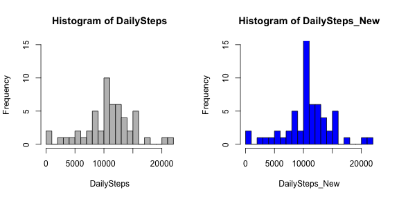
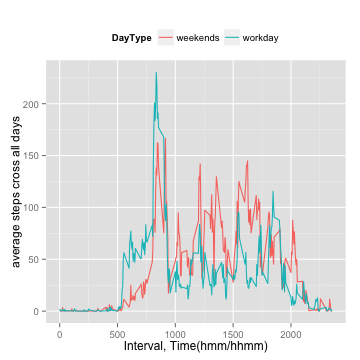
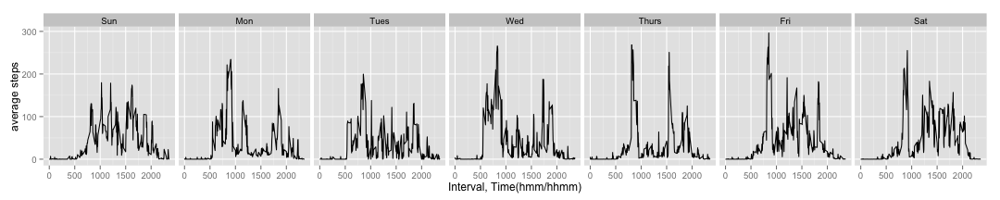

## Loading and preprocessing the data
- set working directory

```r
setwd("/Users/liwenlong/Documents/Coursera/RepDataAndStatInference/RepData_PeerAssessment1")
getwd()
```

```
## [1] "/Users/liwenlong/Documents/Coursera/RepDataAndStatInference/RepData_PeerAssessment1"
```
- Since the data is in a zip file, need to unzip it first

```r
csvfile<-"activity.csv"
if(!exists(csvfile)){
     unzip(zipfile = "activity.zip")   
}
```
- Read the data to the object Activity
  before this ,roughly review the data and found there is column headers and has NA value in the "steps" column

```r
Activity<-read.csv(csvfile,header = T)
str(Activity)
```

```
## 'data.frame':	17568 obs. of  3 variables:
##  $ steps   : int  NA NA NA NA NA NA NA NA NA NA ...
##  $ date    : Factor w/ 61 levels "2012-10-01","2012-10-02",..: 1 1 1 1 1 1 1 1 1 1 ...
##  $ interval: int  0 5 10 15 20 25 30 35 40 45 ...
```
- Transform date column to Data format

```r
library(lubridate)
attach(Activity)
```

```
## The following object is masked from AverageIntervalStepsWeekends:
## 
##     interval
## 
## The following objects are masked from NewActivity:
## 
##     date, interval, steps
```

```r
date<<-ymd(as.character(Activity$date))
Activity$time<-hm(paste(floor(interval/100),interval%%100,sep=" "))
detach(Activity)
str(Activity)
```

```
## 'data.frame':	17568 obs. of  4 variables:
##  $ steps   : int  NA NA NA NA NA NA NA NA NA NA ...
##  $ date    : Factor w/ 61 levels "2012-10-01","2012-10-02",..: 1 1 1 1 1 1 1 1 1 1 ...
##  $ interval: int  0 5 10 15 20 25 30 35 40 45 ...
##  $ time    :Formal class 'Period' [package "lubridate"] with 6 slots
##   .. ..@ .Data : num  0 0 0 0 0 0 0 0 0 0 ...
##   .. ..@ year  : num  0 0 0 0 0 0 0 0 0 0 ...
##   .. ..@ month : num  0 0 0 0 0 0 0 0 0 0 ...
##   .. ..@ day   : num  0 0 0 0 0 0 0 0 0 0 ...
##   .. ..@ hour  : num  0 0 0 0 0 0 0 0 0 0 ...
##   .. ..@ minute: num  0 5 10 15 20 25 30 35 40 45 ...
```
- I tried to convert the interval to time,but meet a problem when using [lubritime], have no idea how to use it

```r
head(Activity$time)
```

```
## [1] "0S"     "5M 0S"  "10M 0S" "15M 0S" "20M 0S" "25M 0S"
```

```r
unique(Activity$time)
```

```
## [1] 0
```

## Task1, What is mean total number of steps taken per day?
  - Ignore the missing values in the dataset.
  - Make a histogram of the total number of steps taken each day
  - Calculate and report the mean and median total number of steps taken per day

```r
StepsPerDay<-aggregate(Activity$steps,by = list(Date=Activity$date),FUN = sum,na.rm=T)
dim(StepsPerDay)
```

```
## [1] 61  2
```

```r
DailySteps<-StepsPerDay$x
hist(DailySteps,)
```

 

```r
options(digits = 2)
meanSteps<-mean(DailySteps)
medianSteps<-median(DailySteps)
```
The mean of the total number of steps taken per day is : 9354.23, while the median is : 10395. 

## Task2, What is the average daily activity pattern?
- Make a time series plot (i.e. type = "l") of the 5-minute interval (x-axis) and the average number of steps taken, averaged across all days (y-axis)
- Which 5-minute interval, on average across all the days in the dataset, contains the maximum number of steps?

```r
AverageIntervalSteps<-aggregate(Activity$steps,by=list(interval=Activity$interval),FUN= mean, na.rm=T)
dim(AverageIntervalSteps)
```

```
## [1] 288   2
```

```r
with(AverageIntervalSteps,{
        plot(interval,x,
             type="l",
             main = "Average number of steps taken",
             xlab="Interval, Time(hmm/hhmm)",
             ylab="average steps cross all days")
                
})
```

 

```r
maxInterval<-AverageIntervalSteps[AverageIntervalSteps$x==max(AverageIntervalSteps$x),"interval"]
start<-paste(floor(maxInterval/100),maxInterval%%100,sep = ":")
end<-paste(floor(maxInterval/100),maxInterval%%100+5,sep = ":")
```
The interval contains max average steps is **835**, which represent from **8:35**  to **8:40**;  
It should be the time that people goes to work. 

## Task3, Imputing missing values
Note that there are a number of days/intervals where there are missing values (coded as NA). The presence of missing days may introduce bias into some calculations or summaries of the data.  

- Calculate and report the total number of missing values in the dataset (i.e. the total number of rows with NAs)

```r
table(is.na(Activity))
```

```
## 
## FALSE  TRUE 
## 67968  2304
```

```r
sum(is.na(Activity$steps))
```

```
## [1] 2304
```
- Devise a strategy for filling in all of the missing values in the dataset. The strategy does not need to be sophisticated. For example, you could use the mean/median for that day, or the mean for that 5-minute interval, etc.
- Create a new dataset that is equal to the original dataset but with the missing data filled in.

```r
NewActivity<-Activity
attach(NewActivity)
```

```
## The following object is masked from AverageIntervalStepsWeekends:
## 
##     interval
## 
## The following objects are masked from NewActivity (pos = 5):
## 
##     date, interval, steps, time
```

```r
intervalMean<-aggregate(steps,by= list(interval=interval), FUN = mean, na.rm=T)
for(i in 1:length(steps)){
        if(is.na(steps[i])){
                NewActivity$steps[i]<-intervalMean$x[intervalMean$interval==interval[i]]
        }
}
detach(NewActivity)

sum(is.na(Activity$steps))
```

```
## [1] 2304
```

```r
sum(is.na(NewActivity$steps))
```

```
## [1] 0
```
- Make a histogram of the total number of steps taken each day and Calculate and report the mean and median total number of steps taken per day. Do these values differ from the estimates from the first part of the assignment? What is the impact of imputing missing data on the estimates of the total daily number of steps?

```r
with(AverageIntervalSteps,{
        plot(interval,x,
             type="l",
             col="red",
             main = "Average number of steps taken",
             xlab="Interval, Time(hmm/hhmm)",
             ylab="average steps cross all days")
                
})
AverageIntervalStepsNew<-aggregate(NewActivity$steps,by=list(interval=Activity$interval),FUN= mean, na.rm=T)
with(AverageIntervalStepsNew,{
        lines(x=interval,y=x, col = "blue", lty ="twodash" )
})
legend("topright", 
       legend = c("Original","Fix Missing Value"), 
       col = c("red","blue"), 
       lty = c("solid","twodash"),cex=0.8)
```

 

```r
maxInterval<-AverageIntervalStepsNew[AverageIntervalStepsNew$x==max(AverageIntervalStepsNew$x),"interval"]
start<-paste(floor(maxInterval/100),maxInterval%%100,sep = ":")
end<-paste(floor(maxInterval/100),maxInterval%%100+5,sep = ":")
```
The interval contains max average steps is **835**, which represent from **8:35**  to **8:40**;  
Which is the same as the values estimated with missing values and shows that imputing missing data on the estimates of the total daily number of steps has no impact

## Task4, Are there differences in activity patterns between weekdays and weekends?
- Firstly, plot the data of workdays and weekends together

```r
Activity$weekday<-wday(Activity$date,label=T)
Activity$isWeekends<-Activity$weekday %in% c("Sun","Sat")
AverageIntervalStepsWeekends<-
        aggregate(Activity$steps,
                  by=list(isWeekends=Activity$isWeekends,interval=Activity$interval),
                  FUN = mean,
                  na.rm=T)
library(ggplot2)
qplot(data=AverageIntervalStepsWeekends,
      x = interval,
      y = x,
      geom="line",
      col=isWeekends,
      xlab="Interval, Time(hmm/hhmm)",
      ylab="average steps cross all days")
```

 

- Secondly, plot the data of workdays and weekends together 

```r
attach(AverageIntervalStepsWeekends)
```

```
## The following objects are masked from AverageIntervalStepsWeekends (pos = 3):
## 
##     interval, isWeekends, x
## 
## The following object is masked from NewActivity:
## 
##     interval
```

```r
aggregate(x,FUN = mean,by=list(isWeekends=isWeekends))
```

```
##   isWeekends  x
## 1      FALSE 35
## 2       TRUE 43
```

```r
aggregate(x,FUN = median,by=list(isWeekends=isWeekends))
```

```
##   isWeekends  x
## 1      FALSE 24
## 2       TRUE 32
```

```r
detach(AverageIntervalStepsWeekends)
```

We can see that the average steps of weekends if a more than weekdays;  
And the time series pattern is also different:
* In the morning(5~10 o' clock), weekend < workdays;
* In the daylight(10~20 o' clock), weekend > workdays

- Finally, plot the data by weekdays to further understand.

```r
AverageIntervalStepsPerWeekday<-
        aggregate(Activity$steps,
                  by=list(weekday=Activity$weekday,interval=Activity$interval),
                  FUN = mean,
                  na.rm=T)

qplot(data=AverageIntervalStepsPerWeekday,
      x = interval,
      y = x, 
      geom="line",
      facets =.~ weekday, 
      ylab="average steps",
      xlab="Interval, Time(hmm/hhmm)")
```

 

